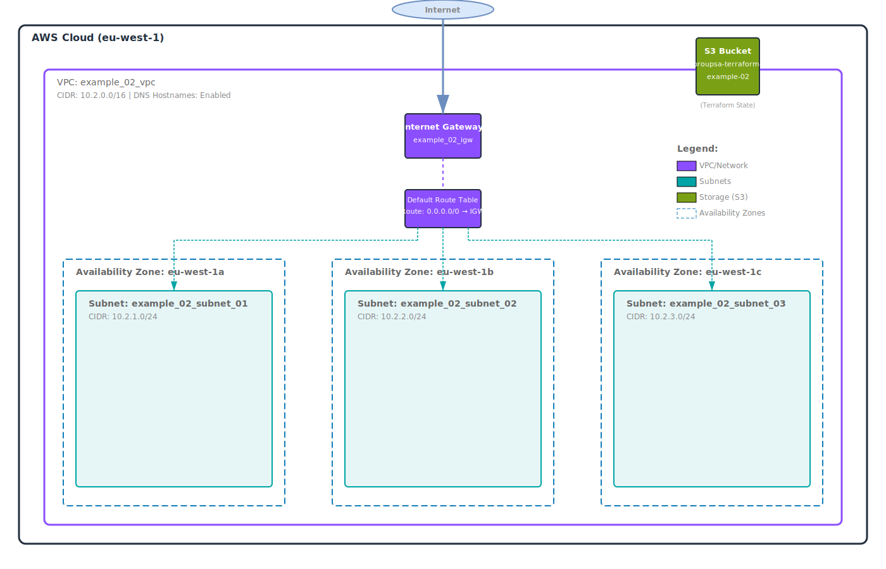

# Example 02 - Create Networking Resources with main.tf

This example demonstrates how to create networking resources such as VPC, subnets, internet gateway, and route tables using Terraform.

## Infrastructure Diagram



The diagram shows the complete AWS infrastructure including:

- VPC (10.2.0.0/16) with DNS hostnames enabled
- Three subnets across different availability zones (eu-west-1a, eu-west-1b, eu-west-1c)
- Internet Gateway for external connectivity
- Default Route Table with internet route (0.0.0.0/0 → IGW)
- S3 bucket for Terraform state storage

## Prerequisites

- Run docker container with Terraform builded from aws/terraform directory: [docker build and run instructions](../README.md)

```bash
cd example_02
```

## Generate Bucket for Terraform State

To manage the Terraform state file, you need to create an S3 bucket. This bucket will store the state file and allow for remote state management.

```bash
aws s3api create-bucket --bucket proupsa-terraform-example-02 --region eu-west-1 --create-bucket-configuration LocationConstraint=eu-west-1
```

## Terraform Initialization

Before running the Terraform commands, ensure you have initialized the Terraform configuration. This step downloads the necessary provider plugins.

```bash
terraform init
```

## Terraform Plan

To see what changes Terraform will make to your AWS environment, run the following command. This generates an execution plan without making any changes.

> You can use the `-out` option to save the plan to a file for later execution:

```bash
terraform plan -out=tfplan
```

## Terraform Apply with target

If you want to apply changes only to specific resources, you can use the `-target` option. For example, to apply changes only to the VPC resource, run:

```bash
terraform apply -target=aws_vpc.vpc_01
```

> WARNING: Using `-target` can lead to an incomplete state if not used carefully. It is recommended to use it only when necessary. You need to generate a new plan after applying the target.

## Terraform Apply

To apply the changes defined in your Terraform configuration, run the following command. This will create the networking resources in your AWS account.

> After running this command, Terraform will prompt you to confirm the changes. Type `yes` to proceed.

```bash
terraform apply tfplan
```

## Terraform Refresh

To refresh the Terraform state with the latest information from your AWS environment, you can run the following command. This updates the state file with the current state of resources.

```bash
terraform refresh
```

## Terraform Output

After applying the configuration, you can view the output variables defined in your Terraform configuration. This will display information such as the VPC ID and subnet IDs.

```bash
terraform output
```

## Terraform State rm

If you need to remove a specific resource from the Terraform state without deleting it from AWS, you can use the `terraform state rm` command. For example, to remove the VPC resource from the state, run:

```bash
terraform state rm aws_vpc.vpc_01
```

> This command will not delete the resource from AWS; it will only remove it from Terraform's management.

## Terraform Import

If you have existing resources that you want to manage with Terraform, you can import them into your Terraform state. For example, to import an existing VPC, run:

```bash
terraform import aws_vpc.vpc_01 VPC_ID
```

## Terraform Destroy

To remove all the resources created by this Terraform configuration, you can run the following command. This will delete the VPC, subnets, internet gateway, and route tables.

> After running this command, Terraform will prompt you to confirm the destruction of resources. Type `yes` to proceed.

```bash
terraform destroy
```
