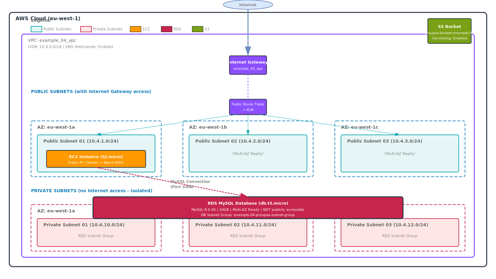

# Example 04 - Network Segmentation: Public EC2 and Private RDS

This example demonstrates how to create a segmented network architecture with:

- **Public subnet**: EC2 instance with public IP and Internet Gateway access
- **Private subnets**: RDS MySQL database in isolated subnets (multi-AZ ready)
- **Security groups**: Separated security groups for EC2 (public access) and RDS (private access only from EC2)

## Infrastructure Diagram



The diagram shows the complete network segmentation architecture including:

- VPC (10.4.0.0/16) with DNS hostnames enabled
- Internet Gateway with public route table
- 3 Public Subnets (10.4.1-3.0/24) with Internet access for EC2 instances
- 3 Private Subnets (10.4.10-12.0/24) isolated from Internet for RDS database
- EC2 instance (t2.micro) with public IP in public subnet running Docker + Nginx
- RDS MySQL database (db.t3.micro) in private subnets, multi-AZ ready, not publicly accessible
- MySQL connection from EC2 to RDS (port 3306)
- S3 bucket with versioning enabled

## Architecture

### Network Design

- **VPC**: 10.4.0.0/16
- **Public Subnets**:
  - 10.4.1.0/24 (eu-west-1a)
  - 10.4.2.0/24 (eu-west-1b)
  - 10.4.3.0/24 (eu-west-1c)
  - For EC2 instances
- **Private Subnets**:
  - 10.4.10.0/24 (eu-west-1a)
  - 10.4.11.0/24 (eu-west-1b)
  - 10.4.12.0/24 (eu-west-1c)
  - For RDS (multi-AZ subnet group)

### Security

- **EC2 Security Group**: Allows SSH (22), HTTP (8000) from Internet, all outbound traffic
- **RDS Security Group**: Allows MySQL (3306) only from EC2 security group
- **RDS**: Not publicly accessible, only reachable from EC2 instances

### Components

1. **VPC** with DNS hostnames enabled
2. **Internet Gateway** attached to VPC
3. **Public Route Table** with route to Internet Gateway
4. **EC2 Instance** in public subnet with public IP
5. **RDS MySQL** in private subnets without public access

## Prerequisites

- Run docker container with Terraform builded from aws/terraform directory: [docker build and run instructions](../README.md)

```bash
cd example_04
```

## Terraform Initialization

Before running the Terraform commands, ensure you have initialized the Terraform configuration. This step downloads the necessary provider plugins.

```bash
terraform init
```

## Terraform Plan

To see what changes Terraform will make to your AWS environment, run the following command. This generates an execution plan without making any changes.

> You can use the `-out` option to save the plan to a file for later execution:

```bash
export TF_VAR_rds_password="tu_password_segura"
terraform plan -out=tfplan
```

## Terraform Apply

To apply the changes defined in your Terraform configuration, run the following command. This will create the networking resources in your AWS account.

> After running this command, Terraform will prompt you to confirm the changes. Type `yes` to proceed.

```bash
terraform apply tfplan
```

## SSH conection to EC2 Instance

To connect to the EC2 instance created by Terraform, you need to use SSH. A key pair is generated during the Terraform apply process, and you can use it to connect to the instance.

```bash
ssh -i ec2_key.pem ubuntu@<EC2_INSTANCE_PUBLIC_IP>
```

## Terraform Destroy

To clean up and remove all the resources created by Terraform, you can run the destroy command. This will delete all the resources defined in your Terraform configuration.

```bash
terraform destroy
```
